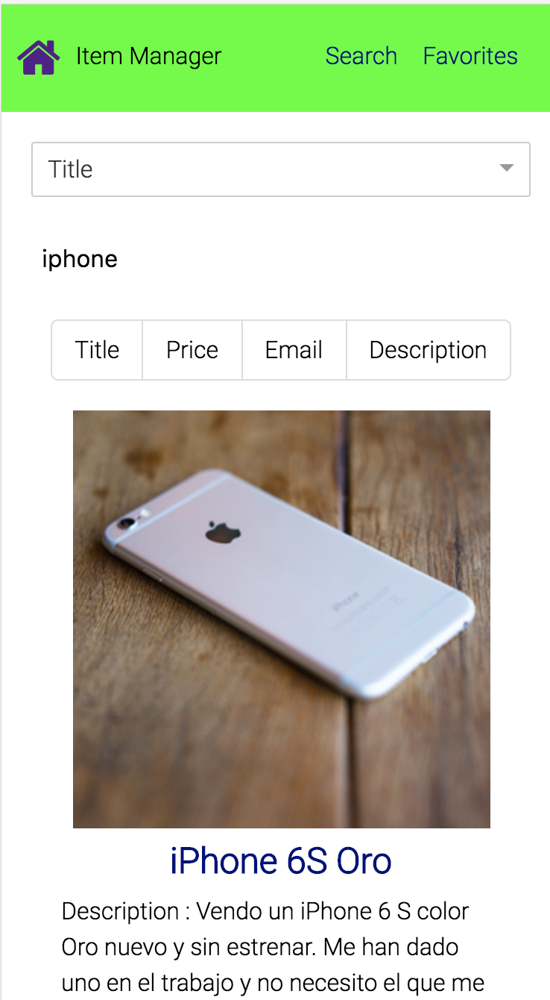
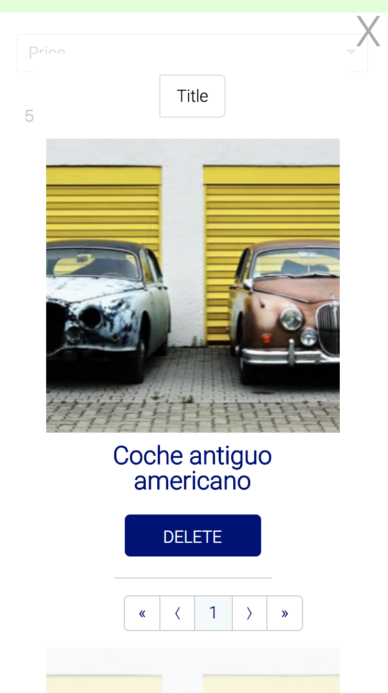

# Item Manager

Item Manager allows the user to add to favorites items available in the store. Users can delete the items from the list of favorites as well and sort them by title, price, description and email.

# Tech Stack

* [React](https://reactjs.org/)
* [Redux](https://redux.js.org/)

# Installation

- Clone the repo and cd into it
- Run ``npm install``
- Run ``npm start``

# Screenshots

